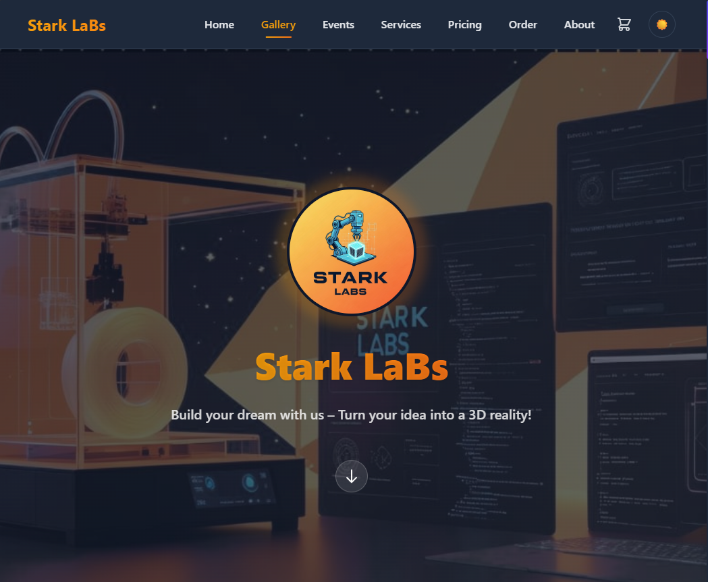
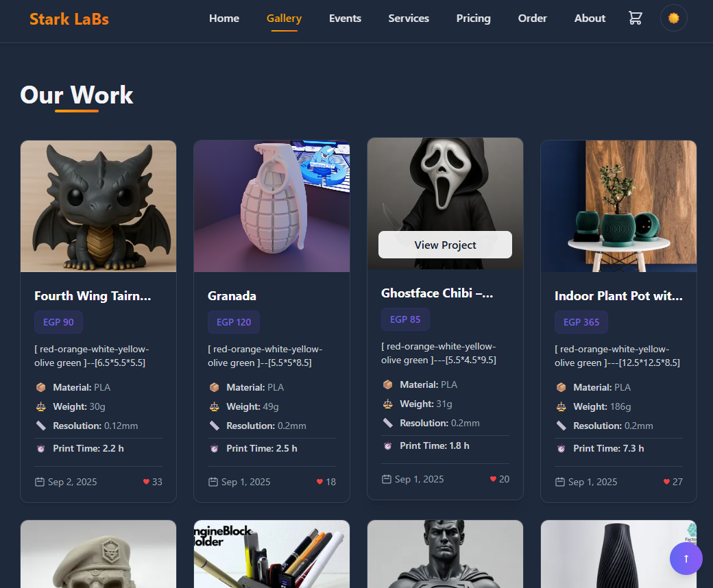
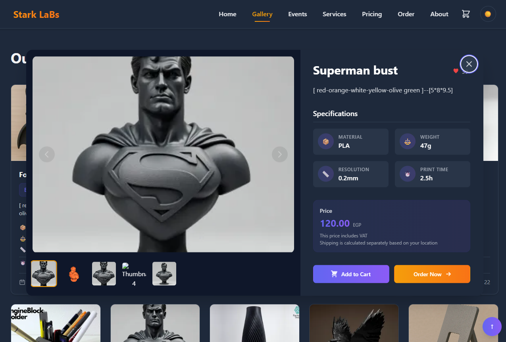
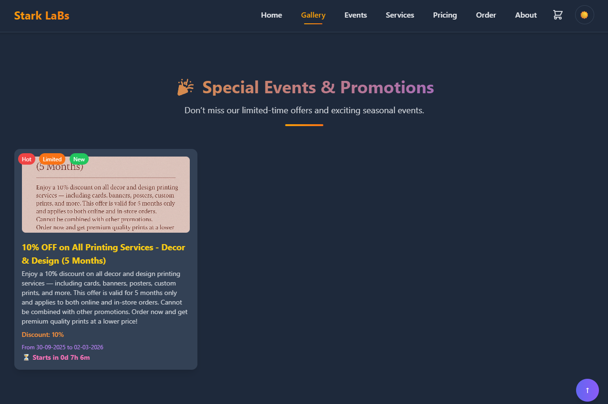
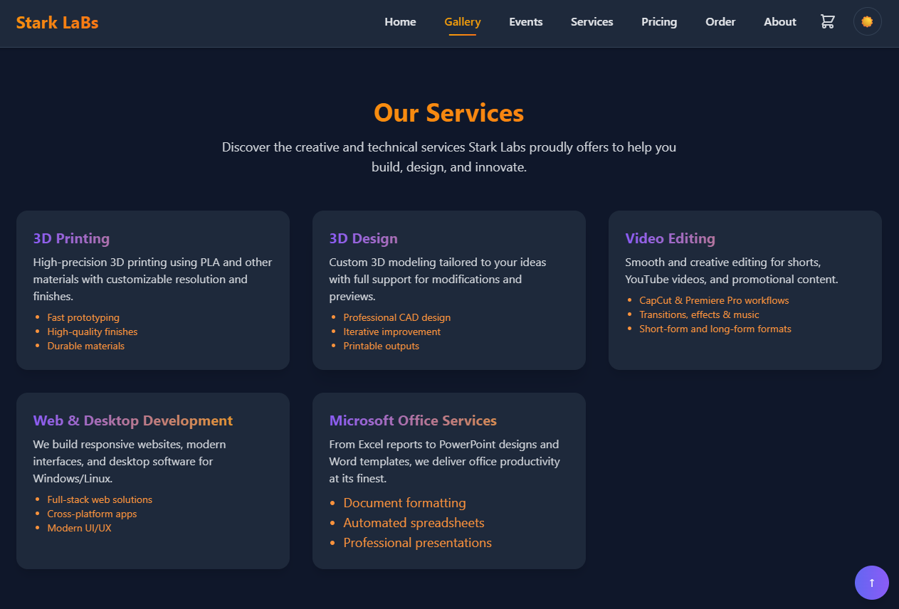
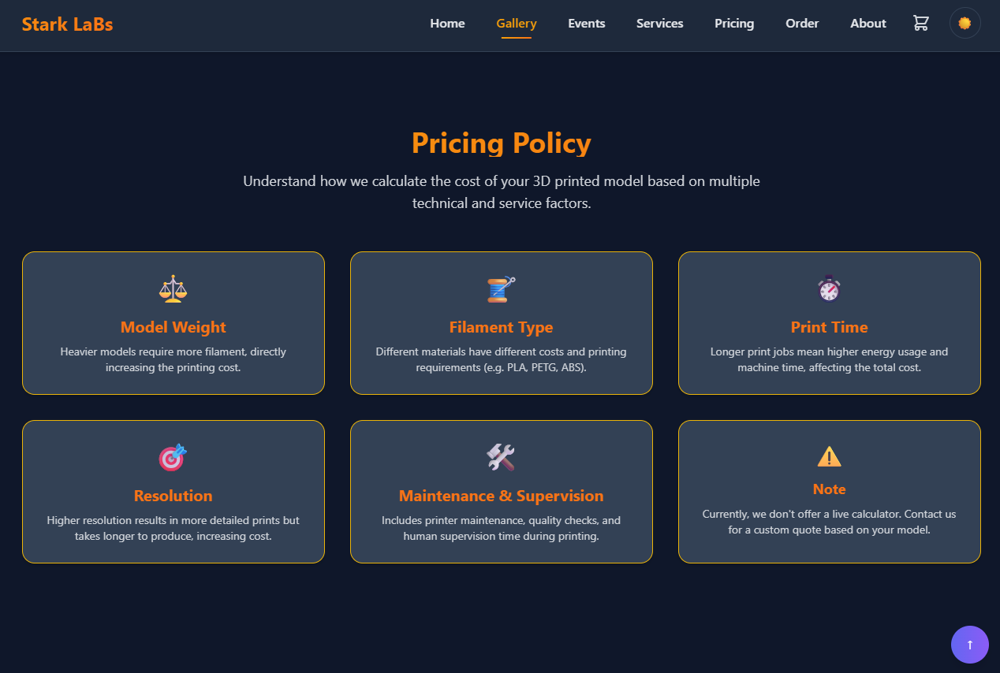
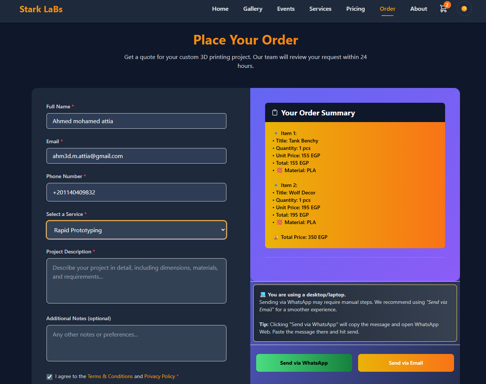
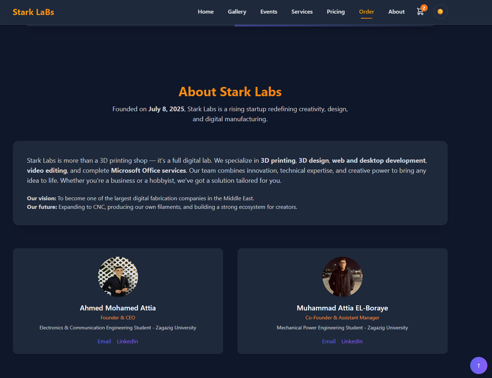

# Stark Labs - 3D Printing Services

A modern, responsive website for **Stark Labs**, offering professional 3D printing services with an interactive gallery, service catalog, and online ordering system.








--

## 🌟 Features

- **Interactive Gallery**: Showcase of 3D printed projects with detailed views
- **Service Catalog**: Comprehensive list of 3D printing services with pricing
- **Online Ordering**: Easy-to-use order form with file upload functionality
- **Responsive Design**: Works seamlessly on desktop and mobile devices
- **Dark/Light Mode**: Toggle between light and dark themes
- **Shopping Cart**: Add multiple items to cart before checkout
- **Project Showcase**: Detailed project views with specifications and pricing

## 🛠️ Technologies Used

### Frontend
- HTML5, CSS3, JavaScript (ES6+)
- **Tailwind CSS** for styling
- Custom animations and transitions
- Responsive design principles
- Dark/light theme support

### Backend
- Form handling with JavaScript
- Local storage for cart persistence
- File upload handling

## 🚀 Getting Started

### Prerequisites
- Modern web browser (Chrome, Firefox, Safari, Edge)
- Node.js and npm (for development)

### Installation

1. Clone the repository:
```bash
git clone https://github.com/Ahm3d0x/3D.starkLaBs.git
cd 3D.starkLaBs
```

2. Open `index.html` in your preferred web browser.

## 📂 Project Structure

```
3D.starkLaBs/
├── css/               # Custom CSS styles
├── js/                # JavaScript files
│   ├── main.js        # Main application logic
│   ├── cart.js        # Shopping cart functionality
│   ├── event.js       # Event handling
│   └── viewer.js      # 3D model viewer
├── gallery/           # Project gallery images
├── events/            # Event-related files
├── index.html         # Main HTML file
├── style.css          # Main stylesheet
└── README.md          # Project documentation
```

## 🎨 Customization

### Theme Colors

Edit the `tailwind.config.js` file to customize the color scheme:

```javascript
module.exports = {
  theme: {
    extend: {
      colors: {
        'brand': {
          'yellow': '#f59e0b',
          'orange': '#f97316',
          'indigo': '#6366f1',
          'purple': '#8b5cf6',
        },
      },
    },
  },
}
```

## 📝 Ordering Process

1. Browse the gallery and services
2. Select your desired service
3. Fill out the order form with project details
4. Upload your 3D model file
5. Review your order in the cart
6. Submit your order via WhatsApp or Email

## 📞 Contact

For inquiries or support, feel free to reach out through:
## 👨‍💻 Developer
**Name:** Ahmed Mohamed Attia  
**Location:** Kafr Saqr, Sharqia, Egypt  
**GitHub:** [Ahm3d0x](https://github.com/Ahm3d0x)  
**LinkedIn:** [Ahmed M. Attia](https://www.linkedin.com/in/ahmed-mohamed-attia-03320a308/)

## 📜 License

This project is licensed under the **MIT License** - see the LICENSE file for details.

## 🙏 Acknowledgments

- **Google Fonts** for typography
- **Heroicons** for beautiful SVG icons

---

## 🔗 Related Projects

### 1. StarkLabs Project JSON Panel
A modern admin panel for managing 3D printing project data with JSON generation.

**Features:**
- Modern UI/UX with light/dark theme support
- Form-based interface for easy data entry
- Real-time JSON preview
- Automatic path generation for models/images
- Print time calculator
- Input validation and data management

**Links:**
- [GitHub Repository](https://github.com/Ahm3d0x/StarkLabs-Project-JSON-Panel-helper-site)
- [Live Demo](https://ahm3d0x.github.io/StarkLabs-Project-JSON-Panel-helper-site/)

### 2. StarkLabs Event JSON Panel
A dashboard for creating and managing event offers with auto JSON generation.

**Features:**
- Event management with dates and discounts
- Tag system for categorization
- Real-time JSON preview
- Mobile responsive layout
- Dark mode support

**Links:**
- [GitHub Repository](https://github.com/Ahm3d0x/starklabs-event-json-panel)
- [Live Demo](https://ahm3d0x.github.io/starklabs-event-json-panel/)


---
---

© 2025 Stark Labs. All rights reserved.